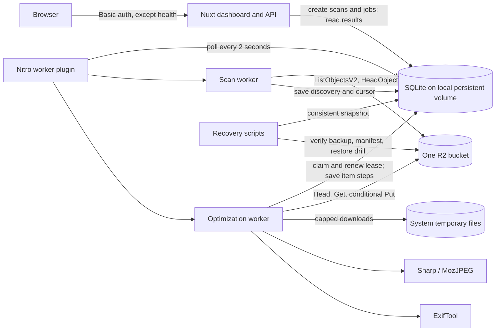
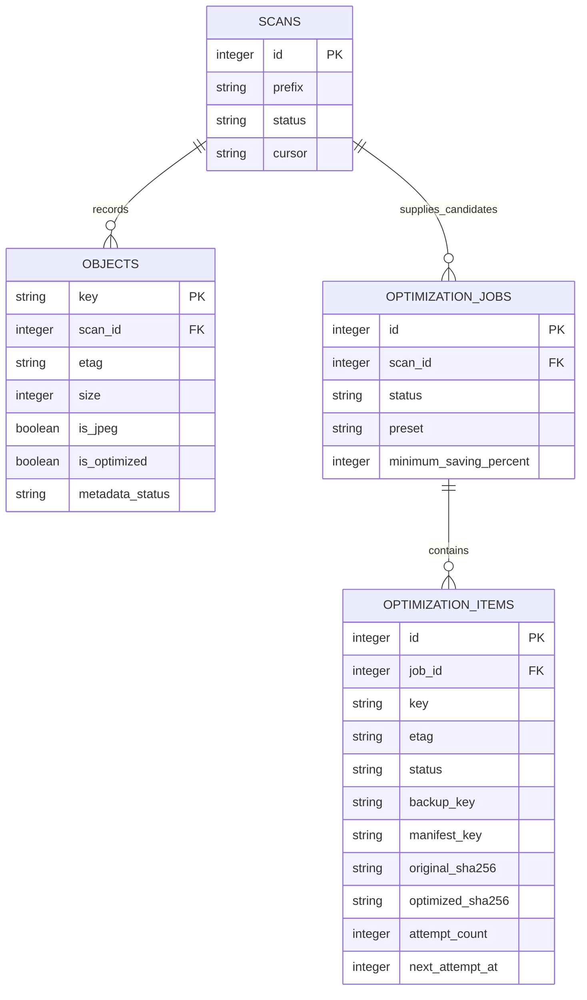

# Architecture overview

R2 JPEG Optimizer is a self-hosted Nuxt application that scans one Cloudflare R2 bucket and conditionally replaces qualifying JPEGs with smaller, validated versions. The app keeps job progress in SQLite and the original image plus a restore manifest in R2. Optimization runs one item at a time.

## System map



| Component | Responsibility | Main code |
| --- | --- | --- |
| Dashboard and API | Authenticate, validate input, display scan and job results, enqueue work | `app/pages/index.vue`, `server/api/`, `server/middleware/auth.ts` |
| Scan worker | Discover keys, identify JPEGs, inspect optimizer metadata, persist a resumable cursor | `server/utils/scanner.ts` |
| Optimization worker | Process one item at a time, save intent and verification steps, classify failures, reconcile uncertain writes | `server/utils/jobs.ts` |
| Image pipeline | Decode and validate JPEGs, recompress, check dimensions and selected EXIF/ICC metadata | `server/utils/image.ts` |
| SQLite | Store bucket identity, scans, current discovery rows, jobs, items, and worker lease | `server/utils/db.ts`, `server/utils/schema.ts` |
| R2 | Store source objects, verified original backups, and independently readable manifests | `server/utils/r2.ts`, `server/utils/backup-manifest.ts` |
| Recovery commands | Snapshot SQLite, backfill older manifests, test a restore without replacing the source | `scripts/snapshot-db.mjs`, `scripts/backfill-manifests.mjs`, `scripts/restore-drill.mjs` |

The Nitro plugin starts work on launch, polls for queued work every two seconds, and shuts down the workers and ExifTool cleanly. A SQLite lease selects one worker owner; deploy one app instance with SQLite WAL on a **local** persistent volume. The database binds itself to one R2 endpoint and bucket and refuses a different identity.

## Data model



`objects` is the current discovery view keyed by R2 object key; a later scan can update a row and its `scan_id`. A job copies each candidate's key, ETag, and size into `optimization_items` at creation, in batches of 100 within one SQLite transaction. The worker then uses those saved values to detect a source changed since the scan. `database_identity` stores the endpoint and bucket; `worker_lease` stores the current owner and expiry. Those two tables are not per-job records.

## End-to-end flow

### 1. Scan without changing R2

`POST /api/scan` enqueues a scan for the supplied key prefix. The worker lists R2 objects in pages of up to 1,000 and calls `HeadObject` for JPEG keys to read `image-optimizer-version`. It saves discovered rows and the list continuation token in SQLite after each page. JPEGs with an unsuccessful metadata check have `metadata_status = unknown` and cannot enter an optimization job.

For example, a scan of `photos/2026/` may find `photos/2026/IMG_0123.JPG` (eligible), `photos/2026/IMG_0124.jpg` (already marked optimized), and `photos/2026/notes.txt` (not a JPEG). Matching is case-insensitive for `.jpg` and `.jpeg`. The scanner excludes `__optimizer/originals/` backups from JPEG discovery. A whole-bucket scan can still see JPEGs left under `__optimizer/restore-drills/`; remove drill copies when finished or filter them out with a narrower job prefix.

### 2. Create a job from a completed scan

The dashboard or `POST /api/jobs` filters known, unoptimized JPEGs by literal key prefix and minimum size. It stores one item per candidate. Defaults are Balanced quality **82**, minimum saving **15%**, metadata preservation on, and mandatory original backup. Archival and Aggressive use qualities 90 and 72.

Example request (illustrative):

```http
POST /api/jobs
Content-Type: application/json

{"prefix":"photos/2026/","minBytes":1048576,"preset":"balanced","minimumSavingPercent":15,"preserveMetadata":true,"backupOriginals":true}
```

The API returns a queued job and candidate count. The worker begins asynchronously; `GET /api/jobs` and `GET /api/jobs/<id>` show progress. Object and item lists are paginated in groups of 100.

### 3. Process one JPEG safely

```mermaid
sequenceDiagram
    participant W as Worker
    participant DB as SQLite
    participant R2 as R2 bucket
    participant T as Temp file
    participant I as Sharp and ExifTool
    W->>R2: HEAD source; compare ETag and size with item
    W->>R2: GET source with If-Match
    R2-->>T: Stream with 128 MiB byte cap
    W->>I: Validate, recompress, validate output and metadata
    alt Saving below threshold
        W->>DB: Mark skipped; do not write to R2
    else Saving meets threshold
        W->>DB: Save backup key and both SHA-256 hashes
        W->>R2: PUT original backup with If-None-Match: *
        W->>R2: GET and HEAD backup; verify hash and headers
        W->>DB: Save backup_verified_at
        W->>R2: PUT and GET restore manifest; verify it
        W->>DB: Save manifest_verified_at and replacement_attempted_at
        W->>R2: PUT optimized source with If-Match: original ETag
        W->>R2: HEAD and GET source; GET backup; verify remote state
        W->>DB: Mark completed and update object size
    end
```

The GET stream is capped even if R2 omits `Content-Length`. The worker hashes downloads while streaming to private temporary files and removes those files after use. Compression still loads the capped original into memory; Sharp can use additional native memory for decoded pixels.

For a 10 MiB original that compresses to 8 MiB, the saving is 20%, so a 15% threshold allows replacement. If it compresses to 9 MiB, the saving is 10%; the worker marks the item `skipped` and writes neither a backup nor a replacement.

### 4. Keep the original independently restorable

For source key `photos/2026/IMG_0123.JPG` and job `42`, the SHA-256 of the **key text** is `eae9ac1fd7359a317d865777c97061a12971b6efe8790645add935594c838d31`. R2 contains these related objects after a successful item:

```text
photos/2026/IMG_0123.JPG
__optimizer/originals/42/eae9ac1fd7359a317d865777c97061a12971b6efe8790645add935594c838d31.jpg
__optimizer/manifests/42/eae9ac1fd7359a317d865777c97061a12971b6efe8790645add935594c838d31.jpg.json
```

The JSON manifest records the bucket, job and item IDs, original key and ETag, backup key, original byte length and SHA-256, object headers, custom metadata, and creation time. Its key mapping is readable directly from R2 if SQLite is lost. The backup key hash is derived from the **source key**; the `sha256` inside the manifest is the hash of the **original bytes**.

For example, an illustrative manifest body looks like this (the byte hash and ETag below are placeholders):

```json
{
  "format": "r2-jpeg-optimizer-backup",
  "version": 1,
  "bucket": "photos-test",
  "jobId": 42,
  "itemId": 301,
  "originalKey": "photos/2026/IMG_0123.JPG",
  "backupKey": "__optimizer/originals/42/eae9ac1fd7359a317d865777c97061a12971b6efe8790645add935594c838d31.jpg",
  "originalETag": "\"example-etag\"",
  "sha256": "<sha256-of-original-file-bytes>",
  "size": 10485760,
  "headers": {
    "contentType": "image/jpeg",
    "cacheControl": null,
    "contentDisposition": null,
    "contentEncoding": null,
    "contentLanguage": null,
    "expires": null,
    "metadata": { "camera": "example" }
  },
  "createdAt": "2026-09-24T12:00:00.000Z"
}
```

The worker never overwrites an existing backup or manifest blindly. It reads them back and verifies content before replacing the source. The source replacement itself is conditional on the original ETag. Optimized objects receive `image-optimizer-version` and job/item metadata so later scans can recognize them.

## Failure and recovery paths

| Situation | Item/job behavior | What happens next |
| --- | --- | --- |
| Source ETag or size differs from the scan, including a conditional `412` | `source_changed`, or `needs_attention` if a write may already have happened | Do not replace a changed source; inspect uncertain remote state |
| Input is not a valid JPEG | Item `invalid_jpeg`; job can finish `completed_with_errors` | Original remains unchanged |
| Network timeout, `429`, or `5xx` | Item `retry_wait` with persisted attempt count and 2 s / 4 s backoff | Retry up to three application attempts; reconcile any prior write first |
| Credentials or bucket-wide failure | Job `paused` | Correct access/configuration and resume the job |
| Backup, manifest, or replacement outcome cannot be established | Item and eventually job `needs_attention` | Inspect source and backup; use **Recheck remote state** / `POST /api/jobs/<id>/reconcile` |

An item is marked `completed` only after the optimized source and original backup match the recorded hashes and the restore manifest is verified. If a replacement succeeded but its response or follow-up check failed, a later run can recognize the worker's metadata and complete the item without another replacement. A job with ordinary failed or invalid-JPEG items ends as `completed_with_errors`. Savings totals remain pending when a replacement or changed source makes final bytes uncertain.

## Operations and trust boundaries

- The dashboard and data APIs require `APP_PASSWORD` through HTTP Basic authentication; `/api/health` is public and checks local SQLite/configuration presence, not live R2 availability. Put HTTPS in front of a deployed app. R2 credentials stay server-side.
- SQLite contains durable progress, retry deadlines, hashes, and the lease. Use `npm run db:snapshot -- --output <new-path>` for a consistent snapshot and keep a verified copy outside the app host.
- R2 backups and manifests are separate prefixes. `npm run manifest:backfill` verifies older backups and creates missing manifests. `npm run restore:drill` can verify a backup without SQLite; with `--apply`, it writes a separate object under `__optimizer/restore-drills/` and checks its hash and headers without changing the source.
- The application does not automatically restore originals or delete backups. Configure a backup expiration rule only after snapshots, manifest verification, and a restore drill. See [README.md](../README.md) for exact commands and deployment steps.
